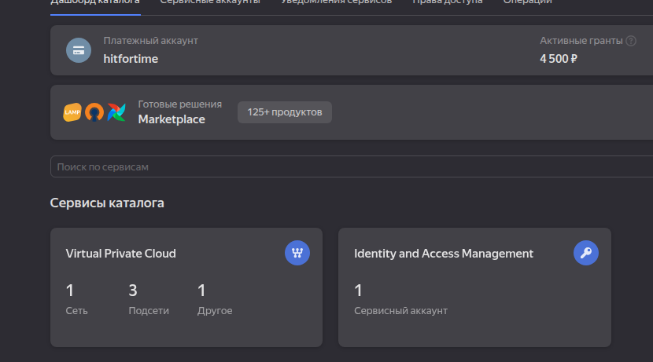
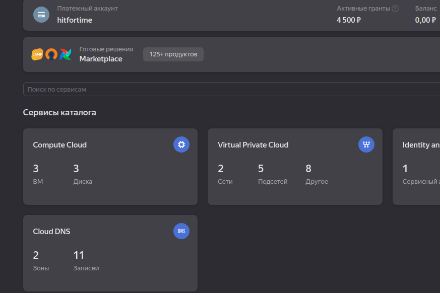
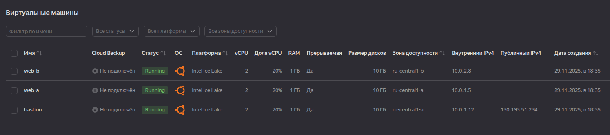
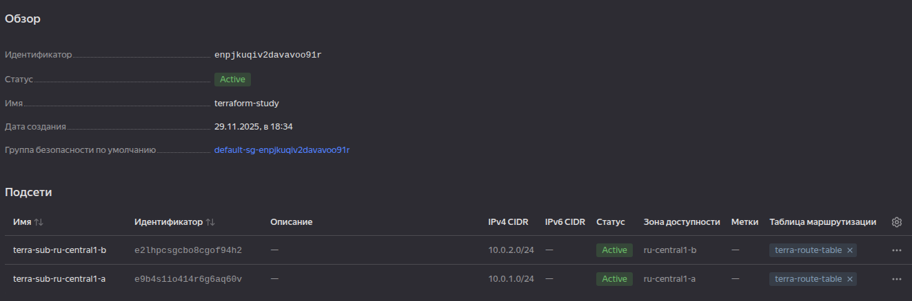
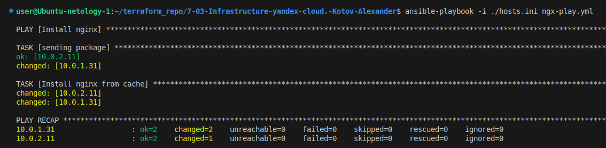
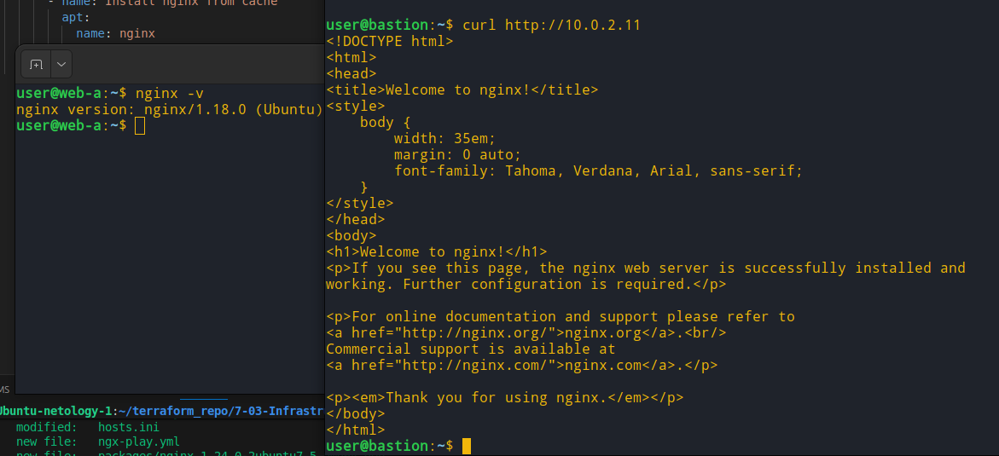

# Домашнее задание к занятию "`7-03-Infrastructure-yandex-cloud`" - `Kotov-Alexander`

---

### Задание 1

#### `Повторить демонстрацию лекции(развернуть vpc, 2 веб сервера, бастион сервер)`

`Яндекс клауд до terraform apply`

`Яндекс клауд после terraform apply`

`Список виртуальных машин, созданных с помощью терраформ`

`Список сетей и подсетей`

---

### Задание 2

#### `С помощью ansible подключиться к web-a и web-b , установить на них nginx.(написать нужный ansible playbook)`

##### Инструкции и плейбук можно посмотреть в репозитори

`Успешный запуск плейбука, которы передает пакет nginx и устанавливает его`

`После выполнения плейбука с nginx`

---